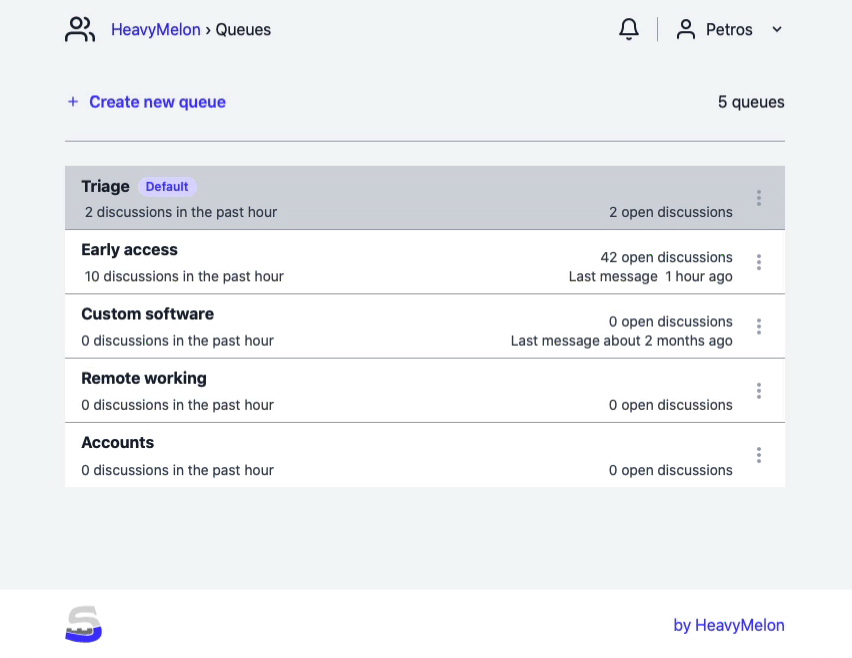

# Inline images

This is an inline image  and this is the sentence continued.

This is an inline image with an original size  and this is the sentence continued.

1. This is an item
2. Another item
3. Another another item
4.  

